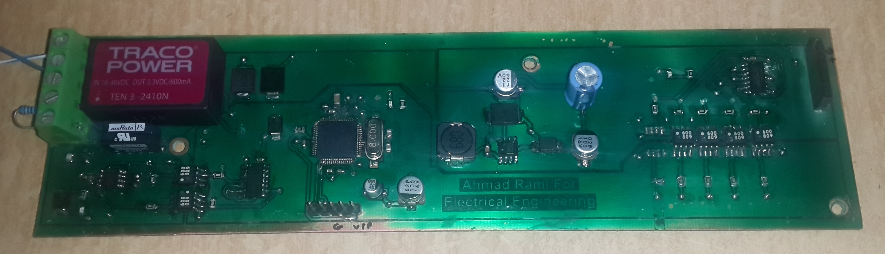
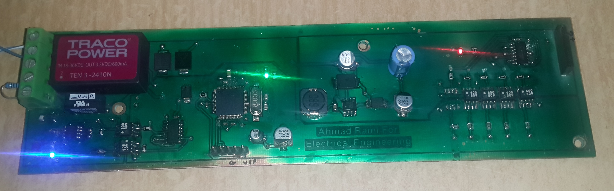

# can-robust-industrial-card
The Project is robust industrial fully isolated CAN bus node cards, designed to be interfaced with a wood sanding machine PLC, actuators and sensors.  
The project contains two cards, basically the hardware is the same except the option of mounting/removing some opto-couplers in each card. The input card interfaces 46 input sensors, to sense the width of the wood piece in real time, while the output card interfaces 46 output air solenoids, to actuate them in realtime as well.
The cards are dsPIC33EP512MC506 microcontroller based which is 3.3 voltage logic, the voltages are fully isolated among the input, output and controller areas. 
The can message is transmitted to/from CAN buffer directly to the RAM using DMA. CPU then is notified with the data presence to read it, or CPU writes the data to the RAM and notifies the DMA to write it to the CAN bus buffer.

Hardware folder contains the Schematic and Layout designed on Altium designer. 
Software folder contains the input and output cards' software codes built on MPLAB X IDE v3.26, C Compiler Version: XC16 v1.26 .

**The Card:**

**The Card Powered:**

